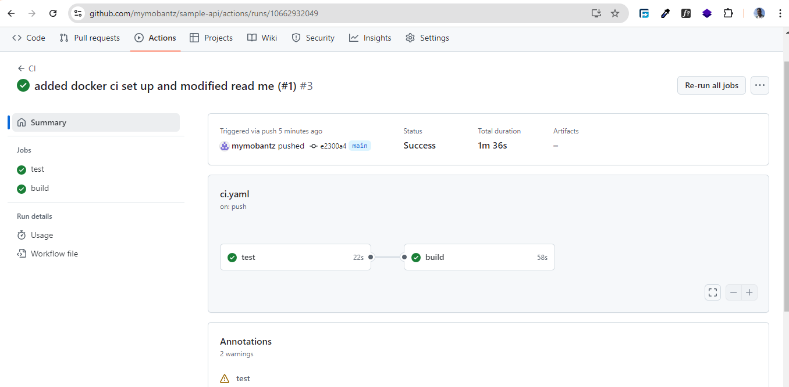

# GitHub Actions Workflows

This directory contains GitHub Actions workflows for our project.

## Current Workflows

### CI Workflow (ci.yml)

This workflow is responsible for running our Continuous Integration (CI) process. It performs the following tasks:

1. **Test**: Runs our test suite on every push to the main branch and on pull requests.
   - Sets up Python 3.12
   - Installs dependencies using Poetry
   - Runs pytest

2. **Build**: If tests pass, it builds our Docker image.
   - Sets up QEMU and Docker Buildx for multi-platform builds
   - Builds the Docker image for linux/amd64 and linux/arm64 platforms
   - If build is successful, the image is  pushed to github registry

## Pull and Run Docker Image

This instructions shows how to pull and run the docker image locally from GitHub Container Registry

- **Pull the Docker Image**
Use the docker pull command to download the image from GHCR

```bash
docker pull ghcr.io/mymobantz/fastapi:latest
```

- **Run the Docker Image**
Once the image is pulled, you can run it using the docker run command. Adjust the port mapping (-p 3000:3000) as needed based on your application's requirements.

```bash 
docker run -d -p 3000:3000 ghcr.io/mymobantz/fastapi:latest
```

- **Access the Application**
Open your web browser and navigate to the URL to access the running application default to localhost: http://localhost:3000

## Viewing and Managing Workflows
- Access Workflows:
- Navigate to the repository on GitHub.
- Go to the "Actions" tab to view a list workflows and recent runs.
- ***Triggering Workflows:*** 
GitHub Actions workflows can be triggered automatically or manually.

1. **Automatic Triggers**
Workflows can be triggered automatically based on GitHub events such as pushes, pull requests, or scheduled times. The trigger conditions are specified the workflow YAML file is based on ***push*** and ***Pull Request***

2. **Manual Triggers**
You can also manually trigger workflows using the "Run workflow" button in the GitHub Actions tab.
    - Go to the "Actions" tab in the repository.
    - Select the workflow you want to run from the list of All workflows.
    - Click the "Re-run all jobs"  or "Re-run failed jobs" button on the top-right to start the workflow.

**Successful Workflow Run in GiHub Action**


